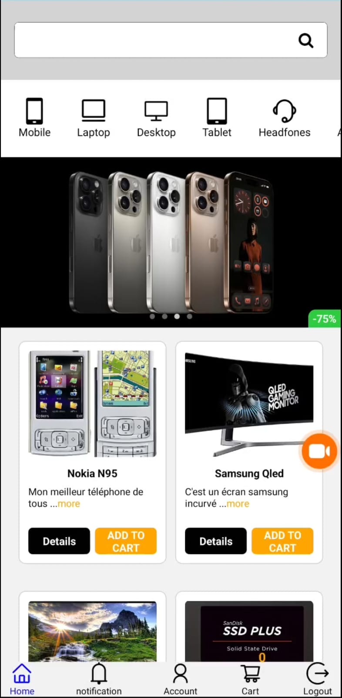

# Tech E-Commerce Mobile App



[](front/assets/videos/app-demo.gif)

## Description


A compact e-commerce application that simulates online purchases of tech products. This full-stack mobile solution provides a seamless shopping experience with secure payments.


## Key Features


- Product browsing and search
- Shopping cart management
- User authentication system
- Online payment simulation
- Media upload and storage
- Order history tracking


## Technology Stack


### Frontend
- **React Native Expo** - Cross-platform mobile development framework
- **Redux** - State management for authentication and shopping cart
- **React Query** - API requests, caching, and data synchronization
- **Axios** - HTTP client for frontend-backend communication

### Backend
- **ExpressJS** - Robust server framework
- **MongoDB** - NoSQL database for product and user data

### Services
- **Cloudinary** - Cloud-based media storage solution
- **Stripe** - Secure online payment processing


## Installation


### Prerequisites
- Node.js (v16 or higher)
- Expo CLI (`npm install -g expo-cli`)
- MongoDB Atlas account or local installation


### Setup Instructions
1. Clone the repository:
   ```bash
   git clone https://github.com/sterel-obame/e-commerce-mobile1.git


# Tech E-Commerce Mobile App


[](https://github.com/sterel-obame/e-commerce-mobile1)
[](LICENSE)
[](https://github.com/sterel-obame/e-commerce-mobile1/commits)


[](https://github.com/sterel-obame/e-commerce-mobile1/actions)
#
